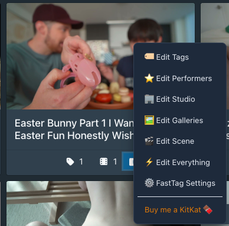
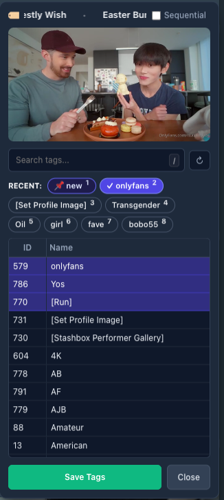
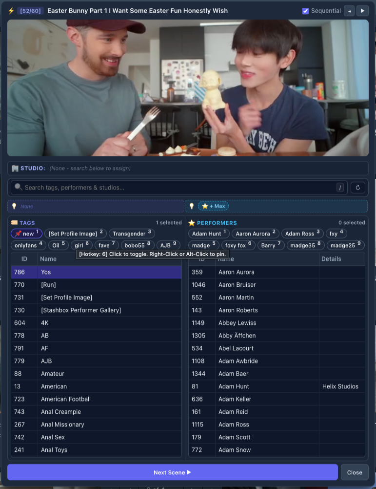

<p align="center">
  
  
  
</p>

# My Stash Plugins

A collection of custom scripts and plugins designed to speed up the [Stash](https://github.com/stashapp/stash) workflow for video scene tagging and metadata cleanup. This repository is focused on fast tagging of scenes, performers, galleries, and related metadata without leaving the library view.

---

## 🛠 Featured Scripts

### FastTag - Scene Manager Context Menu
A fast tagging workflow for Stash scene cards, designed for video libraries where you want to assign tags and performers quickly without leaving the page. 

*   **🎭 Performer Hover ID Card & 1-Click Profile Jump:** Hovering over any performer row displays a frosted glass ID card with their 110×146px portrait photo, rating (`★★★★☆`), country flag (`🇺🇸 US`), gender, age, aliases, and disambiguation. Click the card to open their profile in a new tab! Features smart collision avoidance to never block the floating video HUD.
*   **⤢ Floating Video Popout HUD:** Click `⤢` to detach the video into a 2x floating, resizable window while FastTag collapses into a 33px placeholder bar for 100% vertical table space. Click the placeholder or `⤝` to snap the video back into FastTag instantly!
*   **🎬 Full Video Stream Scrubbing:** Toggle to `🎬 Full Video` to scrub through the entire scene with velocity-based mouse wheel control.
*   **❄️ Hold Shift to Freeze & Step:** Hold <kbd>Shift</kbd> while scrolling to freeze playback and step frame-by-frame with precision.
*   **⚡ Smart Auto-Save Workflow:** Quick-action suggestions, recent pills (`1`–`9`), studio chips, and search-and-select immediately auto-save to the scene. Lower table browsing lets you check multiple items without premature auto-saving.
*   **💾 Save-in-Place Workflow:** Clicking `Save` saves changes directly to Stash while keeping the popup open so you can continue tagging without interruption, preserving your exact scroll position.
*   **🎨 State-Aware Pulsing Save Button:** Save button stays cleanly dimmed/disabled when everything is saved, and lights up **Emerald Green** with a gentle breathing pulse when pending list edits exist.
*   **🛡️ Universal Entity Creation Modal:** Creating a new Tag or Performer from any view opens a confirmation popup to verify spelling, aliases, or cancel before creating.
*   **⚙️ Dedicated FastTag Settings Modal:** Right-click ➔ `⚙️ FastTag Settings` to toggle the numeric ID column, enable/disable suggestions, and switch themes (`Dark`, `Light`, `Match Stash`).
*   **💡 Smart Scene Suggestions:** Automatically detects and suggests matching tags, performers, and studios from filenames, titles, directory paths, and quality badges (`4K`, `1080p`, `NEW`). One-click `+ Tag` or `✓ Accept All` with instant autosave.
*   **📌 Pinned Tokens:** Pin favorite tags, performers, and studios (`Alt + Click` or `Right Click`) for fixed, permanent muscle-memory number hotkeys.
*   **🏢 Full Entity Editing:** Edit Tags, Performers, Studios (with parent hierarchy search), and Galleries directly from any scene card.
*   **⚡ Edit Everything (All-in-One):** Dual-table workspace for editing Tags, Performers, and Studios simultaneously with resizable columns and 16:9 video preview.
*   **📦 Multi-Scene Bulk Tagging:** Batch-apply or remove tags, performers, and studios across multiple selected scenes simultaneously.
*   **⌨️ Number Hotkeys (`1`–`9`) & Search Shortcut (`/`):** Fast single-key toggling for the first 9 tokens, with `/` or `S` to jump into search across all views.
*   **🔁 In-Place Sequential Navigation:** Review and tag scene-by-scene sequentially (`[1/60]`) with instant in-place transitions.
*   **8-Direction Resizing & Size Memory:** Stretch the modal from any edge or corner with automatic size persistence.

*See the full release history in [CHANGELOG.md](plugins/fasttag/CHANGELOG.md) and the comprehensive user guide in [HOWTO.md](plugins/fasttag/HOWTO.md).*

## 📥 Installation

### Method 1: Stash Plugin Manager (Recommended)
1. In Stash, go to **Settings ➔ Plugins ➔ Available Plugins ➔ Add Source**.
2. Paste the Source URL:
   ```text
   https://kmarsh2311.github.io/my-stash-plugins/index.yml
   ```
3. Find **FastTag** in the list and click **Install**.

### Method 2: Manual Installation
1. Download `fasttag.js` and `fasttag.yml` from `plugins/fasttag/`.
2. Place them into your Stash plugins folder: `.stash/plugins/mypluginrc/`.
3. Go to **Settings ➔ Plugins** and click **Reload Plugins**.

---

## 📖 How to Use

> For the full illustrated guide and workflows, see **[HOWTO.md](plugins/fasttag/HOWTO.md)**.

* **Open FastTag:** **Right-Click** anywhere on any scene card in Stash to open the context menu.
* **⚡ Edit Everything:** Tag everything in one unified window with dual side-by-side tables for Tags & Performers, dedicated Studio bar, smart suggestions, and 16:9 video preview.
* **Single Entity Modes:** Choose `Edit Tags...`, `Edit Performers...`, `Edit Studio...`, or `Edit Galleries...` for focused edits.
* **🔁 Sequential Mode:** Check `[x] Sequential` to review and tag scene-by-scene (`[1/60]`) with instant in-place transitions.
* **💡 Smart Suggestions:** 1-click accept tags, performers, and studios auto-detected from filenames, titles, and video quality badges.
* **📌 Pin Favorites:** `Alt + Click` or `Right-Click` any recent chip to pin it for permanent number hotkeys (`1`–`9`).
* **➕ Quick Entity Creation:** Type a new name into search and click `+ Create` to check spelling and aliases before adding it to Stash and your scene.
* **⚙️ FastTag Settings:** Right-click ➔ `FastTag Settings` to toggle database ID columns, enable/disable suggestions, and switch themes.
* **💾 Save in Place:** Clicking `Save` (or pressing `Enter`) saves changes immediately to Stash and keeps the popup open so you can continue tagging.
* **⌨️ Hotkeys:**
  - `Scroll Wheel`: Scrub full video forward/backward (in Full Video mode)
  - `Hold Shift + Scroll`: Freeze video and step frame-by-frame
  - `1`–`9`: Toggle recent chips (auto-saves immediately)
  - `/` or `S`: Focus search
  - `Esc`: Clear search / close popup
  - `Alt + →` / `Alt + ←`: Next / Previous scene in sequential mode
  - `Enter`: Save in place (or Save & Next Scene in sequential mode)

---

## 🎯 Why This Exists
This plugin is built for quickly tagging scenes in a video library, especially when you want to assign metadata like performers, tags, and galleries without opening multiple pages or navigating away from the current view.

---

## 🤝 Support & Contributing
*   **Support:** If you find FastTag helpful, you can [buy me a KitKat here 🍫](https://buymeacoffee.com/kamarsh).
